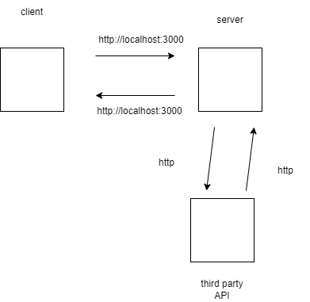
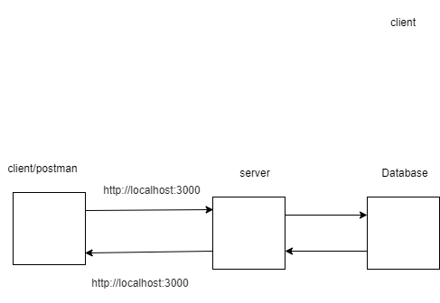
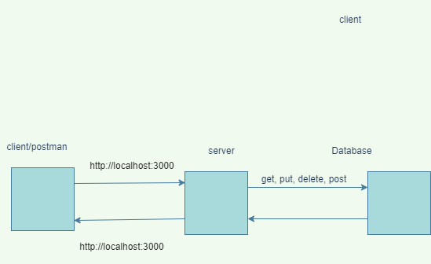

# Movies-Library
# Project Name - Project Version

**Author Name**: Bahsar Owainat

## WRRC
Add an image of your WRRC here

## Project Features
<!-- What are the features included in you app -->

## wrrc for moives
;

## wrrc for third party API
;

## wrrc for client, server and database

;

## wrrc get, post, put and delete

;

### version 1
Get the data from a json file and handle it.

### version 2
Get the data from a third party API

### version  3
add data to a db and get it using post and get

### version 4
get, update and delete a specific movie from a db 