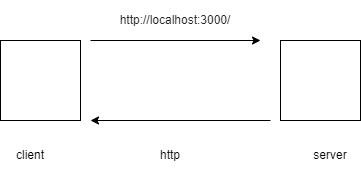
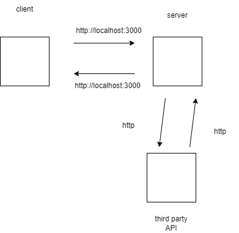
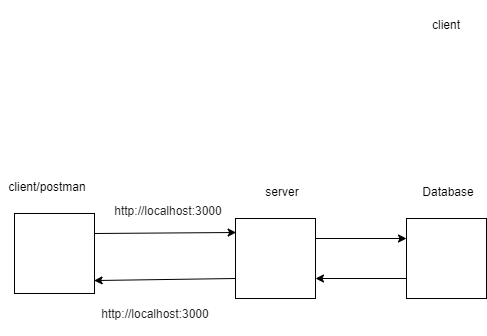

# Movies-Library
# Project Name - Project Version

**Author Name**: Bahsar Owainat

## WRRC
Add an image of your WRRC here

## Overview

## Getting Started
1- Create server.js file

2- npm init -y

3- npm install express

4- const express = require("express")

5- const app = express()

6- app.listen(PORT, ()=>{ console.log("Anything") })

7- I can create end points (ex: app.get("/", helloWorldHandler))

8- I will create the function for that end point(ex: helloWorldHandler)

## Project Features
<!-- What are the features included in you app -->

## wrrc for moives
;

## wrrc for third party API
;

## wrrc for client, server and database

;

### version 1
Get the data from a json file and handle it.

### version 2
Get the data from a third party API

### version  3
add data to a db and get it using post and get